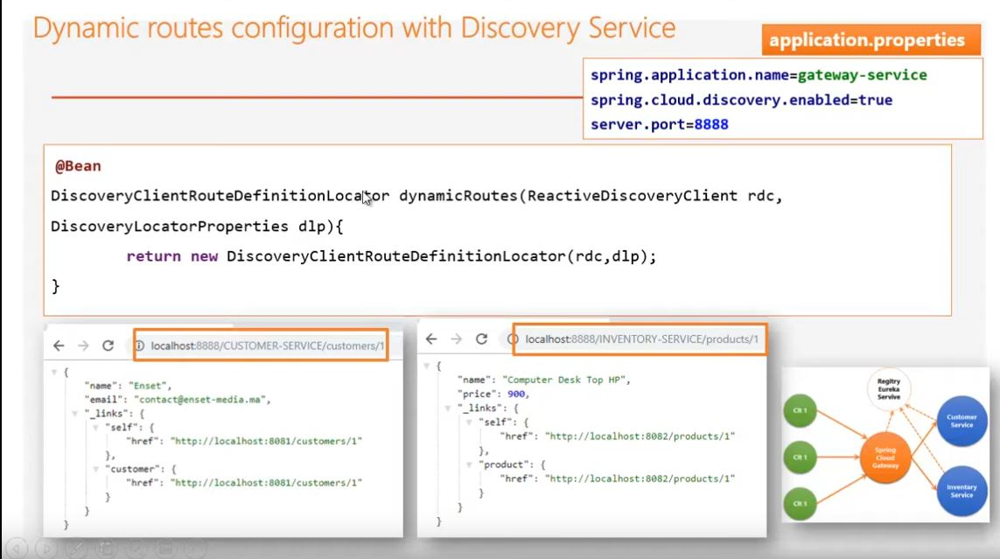

# spring Gateway

## definition des routes static via appliation.yml file

## définition de routes statique sur la base de services

## definition des routes programmatiquement

## les dynamiques routes s'effectue via le service eureka sever

##filter 

