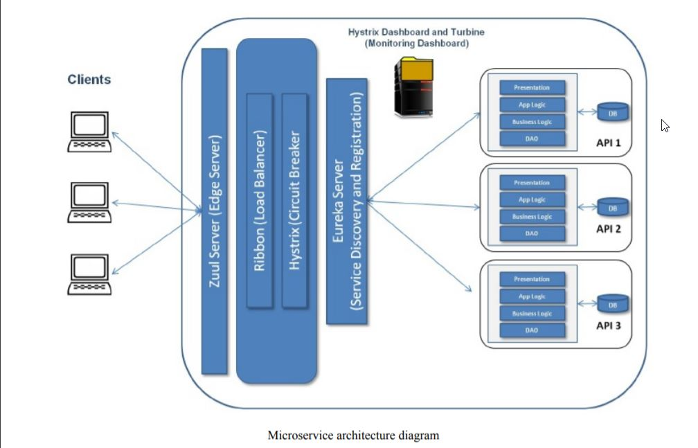
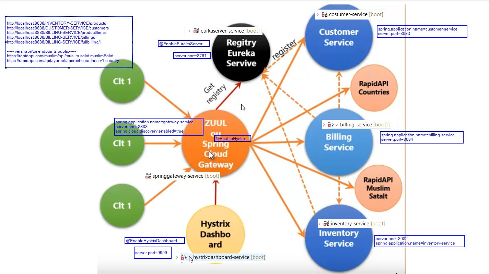
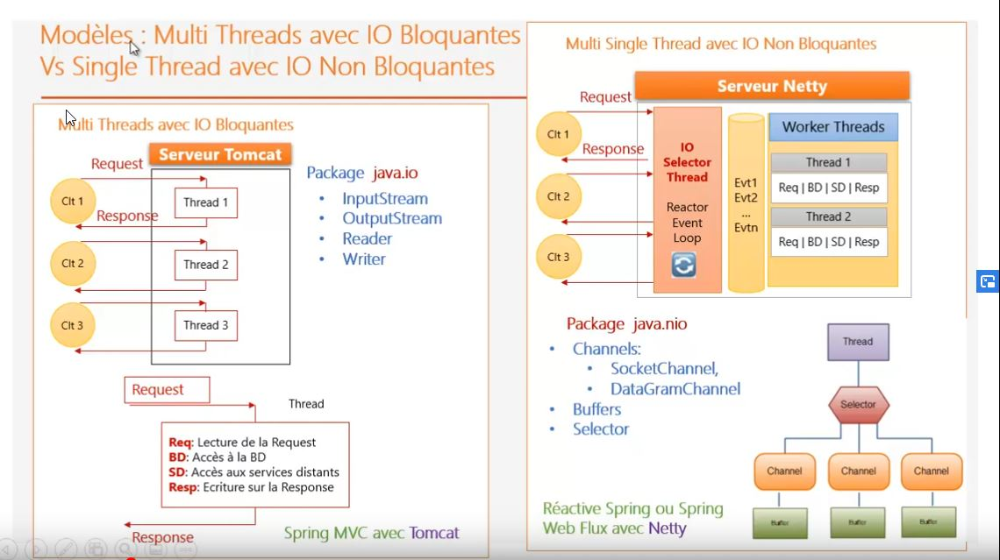
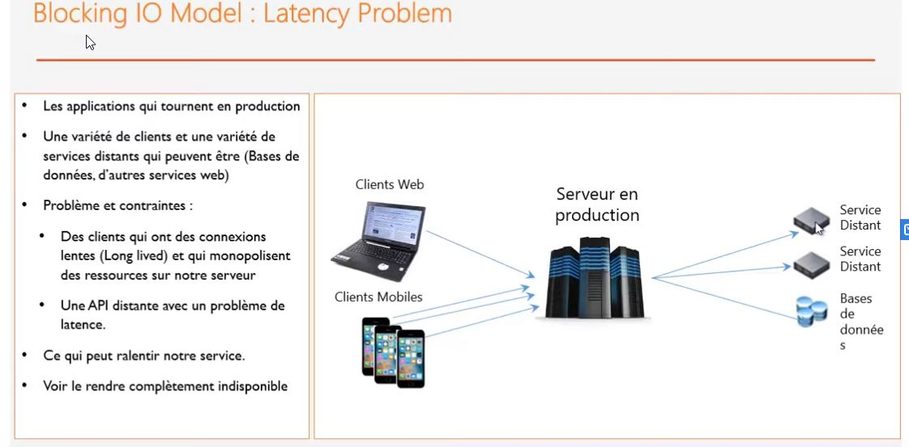
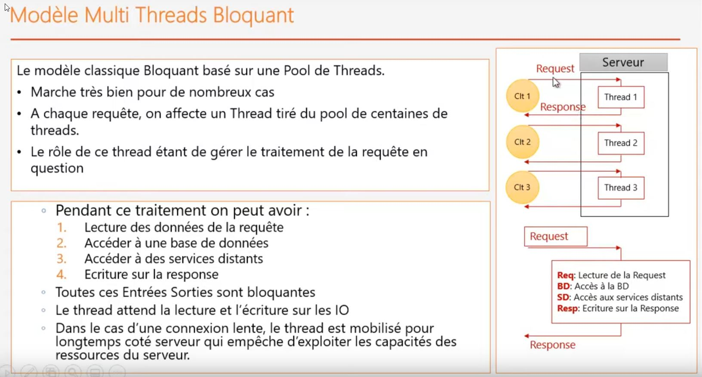
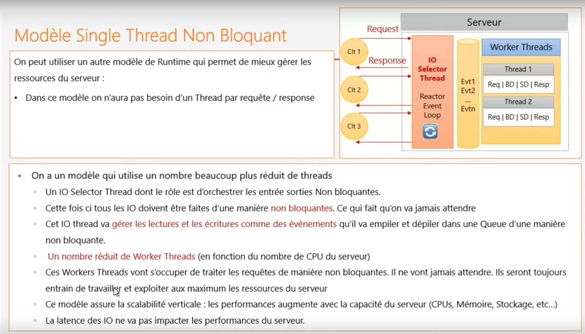
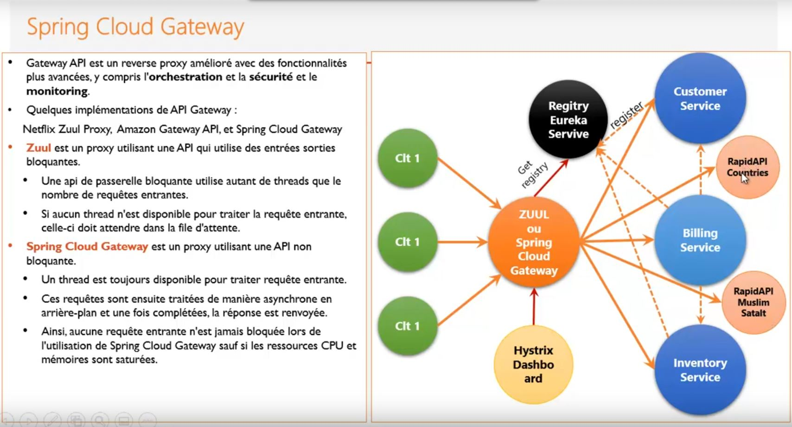
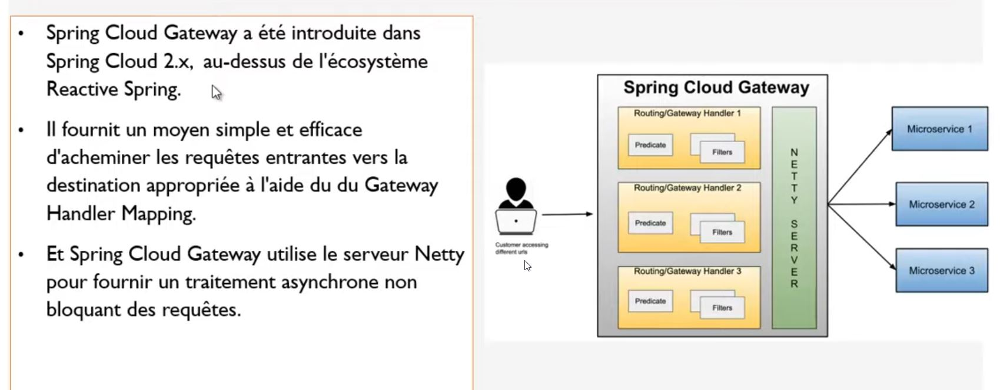
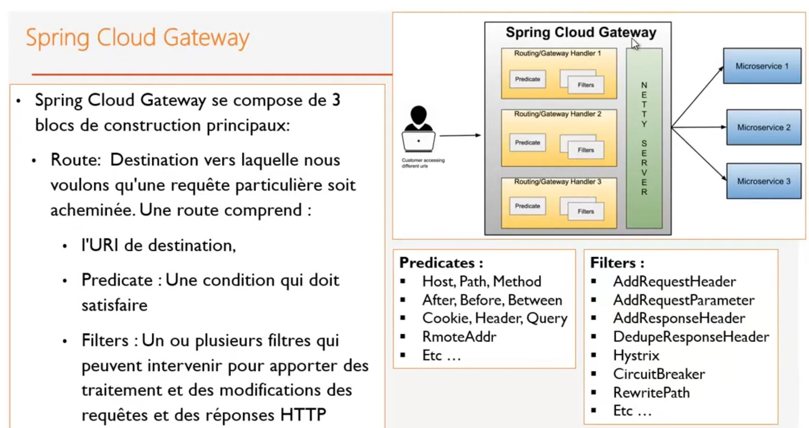
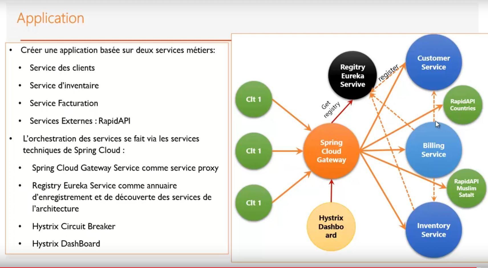

## principle  OSS ( Open Software Service de netflix)

## Application
ici nous utilisons pas **zuul** (model multithread bloquant) comme proxy  mais plutot **spring gateway** ( model single thread non blquant)

# Thread bloquant non blqouant

# Probematique du Modele de mutli thread bloquant ( model spring mvc )
Lorsque un client web ou mobile utilise une technologie hardware trop veille ( faible latence réseaux), la connexion en provenance de ces clients pénalise le server applicatif. Pour chaque des connexions, le server applicatif reserve un thread. Or les threads sont limités. Se qui induit un probleme de blocage et de latence pour tous lse autres clients normaux bien que le sereur a toute sa puissance.Cette technologie d'affectation d'un thread pour toutes connexion s'appelle **thread bloquant**

 
 
 

#  Modele single thread non bloquant ( model spring webflux  ( reactive spring ) )

 
 
 ##  Spring Cloud gateway
 
 **Zuul gateway** est une gateway basé sur le **multi thread blquant**. **Spring Cloud Gateway** quant à lui s'appuie sur un model de **Single thread non blquant**
 

 A ce jours tomcat n'implemente pas encore le **single thread non blquant**, spring utlise **Netty** par défaut de tomcat à la place pour le model dit ****single thread non blquant**. La partie web s'appuie non plus sur le model **spring mvc** mais plus sur ***reactive spring**

 

    
## Projet Application

 
 
 ## links
[costumer-server](doc/costumer-service.md)  
[inventory-service](doc/inventory-service.md)  
[billing-service](doc/billing-service.md)  
[springgateway-service](doc/springgateway-service.md)  
[eureka-service](doc/eureka-service.md)  
[rapidAPi](doc/rapidApi.md)  
[turbin](doc/turbin.md)  
[hystrixDashboard](doc/hystrixdashboard.md)  

 ## Links

 ### proxy spring gateway endpoints local
[http://localhost:8888/INVENTORY-SERVICE/products](http://localhost:8888/INVENTORY-SERVICE/products)   
[http://localhost:8888/CUSTOMER-SERVICE/customers](http://localhost:8888/CUSTOMER-SERVICE/customers)  
[http://localhost:8888/BILLING-SERVICE/productItems](http://localhost:8888/BILLING-SERVICE/productItems)  
[http://localhost:8888/BILLING-SERVICE/billings](http://localhost:8888/BILLING-SERVICE/billings)  
[http://localhost:8888/BILLING-SERVICE/fullbilling/1](http://localhost:8888/BILLING-SERVICE/fullbilling/1)  

##### vers rapiApi endpoints public
**https://rapidapi.com/muslim/api/muslim-salat**
[muslimSalat](http://localhost:8888/publicsalatmuslim/london.json)

**https://rapidapi.com/apilayernet/api/rest-countries-v1**
[country](http://localhost:8888/publiccountries/all)

#### eureka enregistrement service
[http://localhost:8761/](http://localhost:8761/)

 ### Server config service
N'est pas mise en place

 #### direct microService customer-service
 [http://localhost:8083/customers](http://localhost:8083/customers)

 #### direct microService inventory-service
 [http://localhost:8082/products](http://localhost:8082/products)

 #### direct microService billing-service
 [http://localhost:8084/productItems](http://localhost:8084/productItems)
 [http://localhost:8084/billings](http://localhost:8084/billings)
 [http://localhost:8084/fullbilling/1](http://localhost:8084/fullbilling/1)

